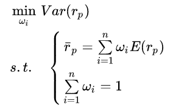
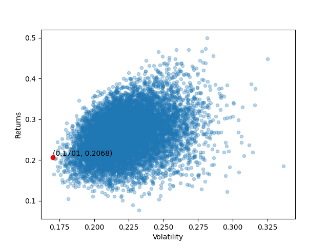

# Assignment3: Markowitz Mean-Variance Portfolio Selection

## 1. Introduction
The Markowitz mean-variance portfolio model simply wants to make a portfolio with the smallest variance at a certain 
level of return.  

The formula of Markowitz mean-variance portfolio selection model is:  



## 2. Application

### 2.1 Environment

1. Language: Python3.9
2. Package: numpy, pandas, matplotlib.pyplot, os

### 2.2 Data

We used the historical data of the ten stocks which are selected from Assignment2.

1. Portfolio stock list: 

   ```
   '600436.SH', '600809.SH', '600900.SH', '601088.SH', '601857.SH'
   '601633.SH', '600745.SH', '600519.SH', '600036.SH', '603501.SH'
   ```

2. Time range: 

   February 1, 2021 to March 1, 2022.

3. sz50.csv: historical data of the Shanghai Stock Exchange 50 constituent stocks from February 1, 2021 to March 1, 2022.
   (Data Source: WIND)

### 2.3 Model
We use Monte Carlo method to find the efficient frontier, and select the minimum variance point. 
First, we divided the historical data to two parts: the training data set and the testing data set. 
We use Monte Carlo method to produce 1000 random weights vector. And use the training data set to calculate 
the return and variance, the plot the scatter diagram. Then, we can find the efficient frontier and the 
minimum variance point. Therefore, we get the portfolio weights for minimum variance portfolio. We use the 
testing data set to see the performance, and the annual return is 21.33%.

The efficient frontier:  


The min-variance point:  


### 2.4 Results
1. Min-Variance Portfolio weights:  

  | Stock Code |  Weight  |
  | :--------: | :------: |
  | 600436.SH  | 0.060672 |
  | 600809.SH  | 0.001446 |
  | 600900.SH  | 0.072718 |
  | 601088.SH  | 0.072718 |
  | 601857.SH  | 0.317710 |
  | 601633.SH  | 0.020239 |
  | 600745.SH  | 0.085771 |
  | 600519.SH  | 0.048300 |
  | 600036.SH  | 0.001781 |
  | 603501.SH  | 0.053656 |

  The return and volatility of min-variance portfolio in training period:

  | Returns  | Volatility |
  | -------- | ---------- |
  | 0.206750 | 0.170067   |
  

2. **Annual return of testing data set: 0.213312467730995.**